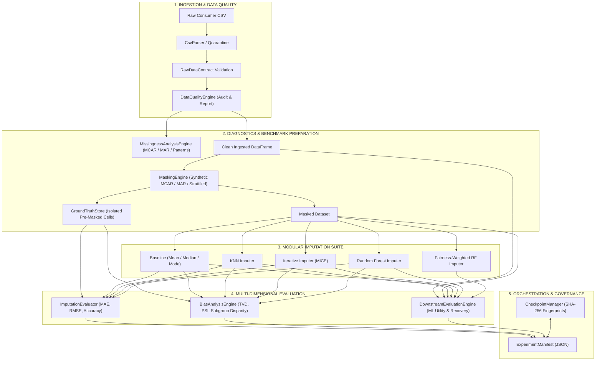
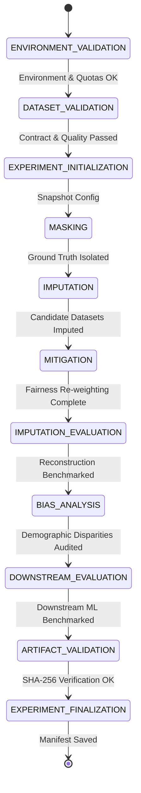
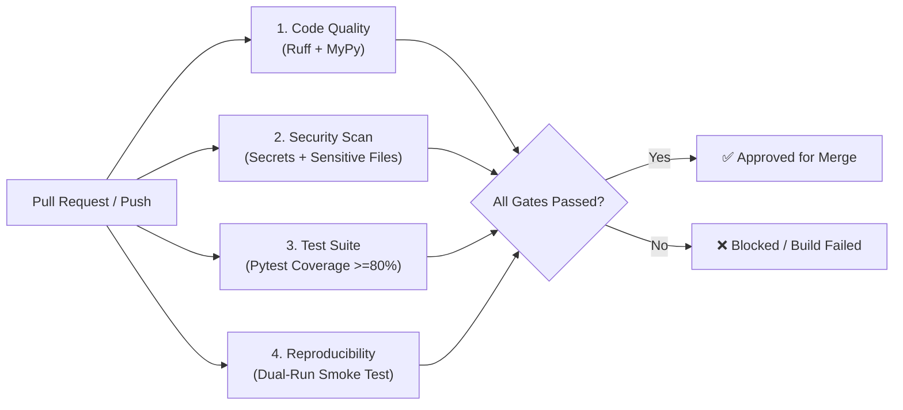

# AI/ML-Based Missing Data Imputation & Bias Reduction Platform

> A production-oriented platform for evaluating missing-data imputation algorithms, mitigating demographic representation bias, and benchmarking downstream machine-learning impact.

[](.github/workflows/ci.yml)
[](pyproject.toml)
[](https://github.com/astral-sh/ruff)
[](https://mypy-lang.org/)
[](pyproject.toml)
[](pyproject.toml)

---

## 1. Project Overview

In enterprise data pipelines and machine learning systems, missing data is rarely uniformly distributed. In real-world consumer datasets, missing values frequently correlate with socioeconomic, demographic, or behavioral attributes (Missing at Random, or MAR). Standard default imputation practices—such as naive mean/median substitution or arbitrary drop policies—distort underlying data distributions, exacerbate representation bias against minority cohorts, and degrade downstream predictive model accuracy.

The **AI/ML-Based Missing Data Imputation & Bias Reduction Platform** (`missing-data-platform`) provides a scientifically rigorous, leakage-free framework for:

1. **Diagnosing missingness patterns** using formal statistical tests (t-tests, Mann-Whitney U, $\chi^2$) to identify Missing Completely at Random (MCAR) vs. Missing at Random (MAR) mechanisms.
2. **Benchmarking multiple imputation strategies** (statistical baselines, $k$-Nearest Neighbors, MICE/Iterative Bayesian Ridge, and Chained Random Forests) against controlled ground-truth masks.
3. **Auditing demographic representation drift and performance disparities** across customer segments using metrics like Total Variation Distance (TVD), Population Stability Index (PSI), and group-sliced reconstruction errors.
4. **Applying fairness-aware mitigation interventions** such as cohort inverse-propensity sample weighting and group-specific models to reduce subgroup disparities.
5. **Evaluating downstream machine learning impact** to measure actual predictive performance delta, percentage of performance recovery, and rank correlation between imputation error and downstream model utility.
6. **Orchestrating end-to-end reproducible experiments** via an 11-stage state-machine engine with cryptographic dataset/config fingerprinting, resumable checkpoints, and comprehensive JSON execution manifests.

### Target Audience

* **Machine Learning Engineers & MLOps Teams**: Designing robust, leakage-free data preprocessing and model evaluation pipelines.
* **Data Scientists & Researchers**: Conducting controlled empirical studies comparing multivariate imputation algorithms and auditing bias propagation.
* **Data Quality & Governance Teams**: Auditing schema conformity, tracking dataset lineage, and ensuring demographic equity across automated decision systems.

---

## 2. Key Features

### Data Quality & Contract Ingestion
* **Typed Data Contract Specification**: Define explicit schema expectations, data types (`STRING`, `INTEGER`, `FLOAT`, `BOOLEAN`), nullability rules, valid category sets, and numerical bounds via `RawDataContract`.
* **Resilient CSV Ingestion & Quarantine**: Automatic delimiter sniffing, encoding detection, and malformed row isolation via `CsvParser` and `SchemaValidator`.
* **Non-Mutating Data Quality Auditing**: Comprehensive rule-based audits checking schema conformance, completeness thresholds, key/row duplicates, and statistical distribution summaries (mean, std, IQR outliers, skewness) via `DataQualityEngine`.
* **Dataset Lineage Tracking**: Cryptographic SHA-256 dataset hashing and quarantine metrics via `IngestionLineage`.

### Missingness Analysis & Diagnostics
* **Multi-Level Missingness Profiling**: Feature-level and row-level missingness distributions, sparsity histograms, and combinatorial co-occurrence pattern detection.
* **Group Disparity Analysis**: Group-sliced missingness rate profiling across demographic attributes (e.g., `age`, `income`, `gender`, `customer_segment`).
* **Statistical Mechanism Diagnostics**:
  * **MCAR Diagnostics**: Two-sample Student's t-tests and Mann-Whitney U tests evaluating covariate distribution independence against missingness indicator masks.
  * **MAR Association Tests**: Contingency table $\chi^2$ tests of independence between categorical attributes and missingness indicators.
  * **MNAR Governance Statement**: Automated generation of formal empirical limitation boundaries regarding non-ignorable missingness.

### Artificial Missingness Generation (Benchmarking)
* **Synthetic Masking Strategies**:
  * `UNIFORM_RANDOM`: Simulates MCAR by sampling uniformly from observed cells.
  * `MAR_COVARIATE_CONDITIONED`: Simulates MAR by sampling cells with probabilities weighted by auxiliary observed features.
  * `STRATIFIED_BY_GROUP`: Proportional masking within demographic/segment strata.
* **Hermetic Ground Truth Store**: Isolated preservation of original pre-masked values and coordinate matrices (`GroundTruthStore`) to enable zero-leakage reconstruction evaluation.

### Modular Imputation Engines
* **Abstract Imputer Interface**: Strict adherence to `BaseImputer` (`fit`, `transform`, `fit_transform`, `get_params`) ensuring stateless transformations and leakage prevention.
* **Baseline Statistical Imputation**: `MEDIAN`, `MEAN`, `MODE`, `CONSTANT`, `ZERO`, `FORWARD_FILL`, and `BACKWARD_FILL` with separate numeric and categorical handling.
* **$k$-Nearest Neighbors (KNN)**: Scikit-learn based KNN imputation with configurable distance weighting (`UNIFORM`, `DISTANCE`), feature scaling (`StandardScaler`, `MinMaxScaler`, `RobustScaler`, or `NONE`), and univariate fallbacks.
* **Iterative Multivariate Imputation (MICE)**: Chained equations using Bayesian Ridge regression with configurable visit orders (`ASCENDING`, `DESCENDING`, `ROMAN`, `ARABIC`, `RANDOM`), initial imputers, and feature clipping bounds.
* **Random Forest Imputation**: Target-specific chained nonlinear Random Forest regressors modeling complex feature interactions with univariate fallbacks.

### Imputation Evaluation & Benchmarking
* **Numerical Reconstruction Metrics**: Mean Absolute Error (MAE), Root Mean Squared Error (RMSE), and Normalized RMSE (NRMSE).
* **Categorical Reconstruction Metrics**: Accuracy and Macro-F1 score.
* **Multi-Method Comparative Rankings**: Automated multi-metric ranking across all candidate imputation algorithms against ground-truth cells.
* **Repeated Multi-Seed Stability**: Multi-run variance estimation and confidence intervals across stochastic sampling seeds.

### Bias & Representation Analysis
* **Demographic Representation Drift**: Population proportion delta ($\Delta p$), Total Variation Distance (TVD), and Population Stability Index (PSI).
* **Subgroup Imputation Disparity**: Sliced MAE, RMSE, and Accuracy evaluated independently across demographic cohorts with sample size suppression thresholds.
* **Pairwise Disparity Metrics**: Automated calculation of absolute differences and relative disparity ratios between demographic subgroups.

### Fairness Mitigation
* **Inverse-Propensity Cohort Weighting**: Sample-weighted Random Forest regressors (`WeightedRandomForestImputer`) prioritizing underrepresented or high-error demographic cohorts.
* **Group-Specific Sub-Models**: Fitting dedicated imputation models per demographic stratum with automatic fallback to global models for small groups.
* **Empirical Trade-off Auditing**: Automated evaluation of accuracy degradation vs. disparity reduction against configurable acceptance criteria (`ACCEPTED`, `REJECTED`, `REQUIRES_REVIEW`).

### Downstream ML Impact Evaluation
* **Supported Estimators & Tasks**: Classification (`RANDOM_FOREST`, `LOGISTIC_REGRESSION`, `GRADIENT_BOOSTING`, `RIDGE`) and Regression (`RANDOM_FOREST`, `GRADIENT_BOOSTING`, `RIDGE`).
* **End-to-End Leakage-Free Preprocessing**: Automated train/test partition isolation, numerical scaling, and categorical one-hot encoding fitted strictly on training data.
* **Performance Delta & Recovery Tracking**: Absolute performance difference relative to complete data and mathematical calculation of Percentage Performance Recovery.
* **Subgroup Disparity Auditing**: Downstream predictive metrics sliced by demographic group to evaluate fairness preservation in final predictions.
* **Imputation-Downstream Rank Correlation**: Spearman rank correlation ($\rho$) evaluating whether lower imputation error translates into superior downstream model performance.

### Production Pipeline Orchestration & Engineering
* **11-Stage State Machine Lifecycle**: Strict transition validation (`PENDING` $\to$ `RUNNING` $\to$ `COMPLETED`/`FAILED`/`SKIPPED`).
* **Cryptographic Dataset & Config Fingerprinting**: SHA-256 hashing across schemas, data types, and configurations to guarantee experiment reproducibility.
* **Resumable Atomic Checkpoints**: Disk-persisted stage checkpoints with fingerprint integrity verification to resume interrupted pipelines.
* **Fault-Tolerant Execution**: Configurable fail-fast vs. partial-failure modes allowing graceful degradation when individual algorithms encounter errors.
* **Execution Manifests**: Cryptographic JSON manifests capturing stage runtimes, method statuses, seed tracking, environment metadata, and artifact references.

---

## 3. System Architecture

The platform follows a modular Clean Architecture where pipeline stages are decoupled and interact through strongly-typed contracts and immutable data structures.

### High-Level Data Flow



### The 11-Stage Production Orchestrator Lifecycle

Every end-to-end experiment run executes through the `PipelineOrchestrator` across 11 sequential stages:



---

## 4. Supported Algorithms & Methodologies

### 1. Missingness Diagnostics & Statistical Tests

| Component | Target Hypothesis | Test / Method Used | Key Outputs |
| :--- | :--- | :--- | :--- |
| **Feature Profiler** | Feature-level Sparsity | Missing cell count & percentage | Sparsity distribution per feature |
| **Row Profiler** | Record-level Completeness | Missing feature counts per row | Completeness histogram & row drop impacts |
| **Pattern Profiler** | Missingness Co-occurrence | Binary incidence combinations | Top co-occurring missingness combinations |
| **MCAR Diagnostics** | $H_0$: Missingness is MCAR | Two-sample Student's t-test / Mann-Whitney U | $p$-values per continuous auxiliary covariate |
| **MAR Diagnostics** | $H_0$: Missingness is independent of group | Contingency table Pearson's $\chi^2$ test | $\chi^2$ statistic, degrees of freedom, $p$-value |
| **MNAR Limitations** | Empirical non-testability | Formal mathematical boundary statement | Non-ignorable missingness risk documentation |

### 2. Controlled Masking Strategies

| Strategy | Description | Mechanism Simulated | Implementation |
| :--- | :--- | :--- | :--- |
| `UNIFORM_RANDOM` | Uniform i.i.d. cell sampling | MCAR | Random choice over observed cell indices |
| `MAR_COVARIATE_CONDITIONED` | Probability weighted by auxiliary feature | MAR | Min-Max normalized covariate sampling weights |
| `STRATIFIED_BY_GROUP` | Proportional sampling within demographic strata | Group-balanced MAR | Stratified sampling across cohort groups |

### 3. Imputation Strategies

| Imputer | Algorithm Class | Key Parameters | Handling of Predictor Missingness |
| :--- | :--- | :--- | :--- |
| **Baseline** | Univariate Summary | Strategy (`median`, `mean`, `mode`, `constant`) | Independent per column |
| **KNN** | Instance-Based Metric | $k$-neighbors, weights (`uniform`/`distance`), scaler | Euclidean distance over observed coordinates |
| **Iterative (MICE)** | Multivariate Chained Equations | `max_iter`, initial strategy, imputation order, bounds | Bayesian Ridge regression with sequential updates |
| **Random Forest** | Nonlinear Tree Ensemble | `n_estimators`, `max_depth`, `min_samples_leaf`, `n_jobs` | Target-specific regressors with univariate training fallbacks |
| **Weighted RF** | Fairness-Aware Mitigation | Group column, `max_sample_weight`, `random_seed` | Inverse cohort-frequency sample weighting |

### 4. Mathematical Evaluation Metrics

#### Imputation Reconstruction Metrics
* **Mean Absolute Error (MAE)**:
  $$\text{MAE} = \frac{1}{N_{\text{masked}}} \sum_{i=1}^{N_{\text{masked}}} |y_i - \hat{y}_i|$$
* **Root Mean Squared Error (RMSE)**:
  $$\text{RMSE} = \sqrt{\frac{1}{N_{\text{masked}}} \sum_{i=1}^{N_{\text{masked}}} (y_i - \hat{y}_i)^2}$$
* **Normalized RMSE (NRMSE)**:
  $$\text{NRMSE} = \frac{\text{RMSE}}{y_{\max} - y_{\min}}$$

#### Bias & Demographic Disparity Metrics
* **Total Variation Distance (TVD)**:
  $$\text{TVD}(P, Q) = \frac{1}{2} \sum_{g \in \mathcal{G}} |P(g) - Q(g)|$$
* **Population Stability Index (PSI)**:
  $$\text{PSI} = \sum_{g \in \mathcal{G}} \left( P(g) - Q(g) \right) \times \ln\left( \frac{P(g)}{Q(g)} \right)$$
* **Subgroup Absolute Disparity**:
  $$\Delta_{\text{disp}} = \max_{g \in \mathcal{G}}(\text{MAE}_g) - \min_{g \in \mathcal{G}}(\text{MAE}_g)$$

#### Downstream Machine Learning Metrics
* **Classification**: Accuracy, Precision, Recall, Macro-F1, ROC-AUC, PR-AUC.
* **Regression**: MAE, RMSE, $R^2$, NRMSE.
* **Performance Recovery Percentage**:
  $$\text{Recovery}_{\text{higher-better}} = \frac{P_{\text{imputed}} - P_{\text{baseline}}}{P_{\text{complete}} - P_{\text{baseline}}} \times 100\%$$
* **Imputation-to-Downstream Correlation**: Spearman rank correlation coefficient ($\rho$) between imputation MAE and downstream Macro-F1 across algorithms.

---

## 5. Installation & Environment Setup

### Prerequisites
* **Operating System**: Linux / macOS / Windows (WSL2 recommended)
* **Python**: `3.10`, `3.11`, `3.12`, or `3.13` (Python `3.11` recommended)
* **Build Tools**: `git`, `make` (optional for CLI shortcuts)

### Step-by-Step Installation

```bash
# 1. Clone the repository
git clone https://github.com/missing-data-platform/missing-data-platform.git
cd missing-data-platform

# 2. Create and activate a dedicated virtual environment
python3 -m venv .venv
source .venv/bin/activate

# 3. Upgrade package installer and install platform with development dependencies
pip install --upgrade pip
pip install -e ".[dev]"
```

Alternatively, use `make`:
```bash
make install
```

### Environment Variable Configuration

Copy the sanitized template to `.env` and configure local parameters:

```bash
cp .env.example .env
```

Key environment configuration variables defined in `src/missing_data_platform/config.py`:

```dotenv
# Application Environment (development | staging | production | test)
APP_ENV=development
APP_NAME=missing-data-platform
APP_DEBUG=true

# Logging Configuration (DEBUG | INFO | WARNING | ERROR | CRITICAL)
LOG_LEVEL=INFO
LOG_FORMAT=json

# Global Random Seed for Deterministic Reproducibility
RANDOM_SEED=42

# Storage & Lakehouse Configuration
USE_LOCAL_STORAGE=true
LOCAL_DATA_DIR=./data
S3_BUCKET_NAME=missing-data-platform-lakehouse
AWS_REGION=us-east-1

# MLflow Experiment Tracking Configuration (Configured)
MLFLOW_TRACKING_URI=http://localhost:5000
MLFLOW_EXPERIMENT_NAME=missing_data_imputation_study
```

---

## 6. Quickstart & Usage Examples

### 1. Executing the End-to-End 11-Stage Hardened Pipeline

```python
import pandas as pd
from missing_data_platform.orchestration.config import (
    ExecutionConfig,
    ExperimentPipelineConfig,
)
from missing_data_platform.orchestration.orchestrator import PipelineOrchestrator

# 1. Load or generate your consumer dataset
df = pd.read_csv("data/consumer_dataset.csv")

# 2. Define experiment configuration
config = ExperimentPipelineConfig(
    experiment_id="consumer_imputation_benchmark_v1",
    dataset_version="2026.08.v1",
    random_seed=42,
    imputation_methods=["baseline_median", "knn", "iterative", "random_forest"],
    execution=ExecutionConfig(
        enable_checkpointing=True,
        checkpoint_dir="./artifacts/checkpoints",
        output_dir="./artifacts/runs",
        fail_fast=False,
    ),
)

# 3. Instantiate orchestrator and execute
orchestrator = PipelineOrchestrator()
manifest = orchestrator.execute_pipeline(df, config=config, run_id="run_001")

# 4. Inspect results from the manifest
print(f"Pipeline Status: {manifest.final_status}")
print(f"Dataset Fingerprint: {manifest.dataset_fingerprint}")
print(f"Total Duration: {manifest.total_duration_seconds}s")
print(f"Stage Durations: {manifest.stage_durations}")
```

### 2. Standalone Missingness Profiling & Statistical Diagnostics

```python
import pandas as pd
from missing_data_platform.missingness.engine import MissingnessAnalysisEngine

df = pd.read_csv("data/consumer_dataset.csv")

# Run non-mutating diagnostics
engine = MissingnessAnalysisEngine(alpha=0.05)
report = engine.analyze(df, dataset_id="consumer_eda")

print(f"Features with missingness: {report.features_with_missingness_count}")
print(f"MCAR significant associations: {report.mcar_diagnostics.significant_tests_count}")
print(f"MAR significant associations: {report.mar_diagnostics.significant_associations_count}")
print(f"Interpretation: {report.executive_statistical_interpretation}")
```

### 3. Comparing Imputation Algorithms Against Controlled Ground Truth

```python
import pandas as pd
from missing_data_platform.evaluation.engine import ImputationEvaluator
from missing_data_platform.imputation.engine import BaselineImputationEngine
from missing_data_platform.masking.config import MaskingConfig, MaskingStrategy
from missing_data_platform.masking.engine import MaskingEngine

df = pd.read_csv("data/clean_consumer_dataset.csv")

# 1. Generate synthetic ground-truth masked dataset
mask_config = MaskingConfig(
    mask_rate=0.15,
    strategy=MaskingStrategy.MAR_COVARIATE_CONDITIONED,
    covariate_column="income",
    random_seed=42,
)
masking_engine = MaskingEngine()
mask_res = masking_engine.generate_benchmark_dataset(df, mask_config)

# 2. Impute with multiple algorithms
imp_engine = BaselineImputationEngine()
imputed_median = imp_engine.impute_dataset(mask_res.masked_dataset).imputed_dataset
imputed_knn = imp_engine.impute_knn_dataset(mask_res.masked_dataset).imputed_dataset
imputed_rf = imp_engine.impute_rf_dataset(mask_res.masked_dataset, random_seed=42).imputed_dataset

# 3. Evaluate reconstruction metrics
evaluator = ImputationEvaluator()
benchmark_report = evaluator.compare_methods(
    imputed_results={
        "median": imputed_median,
        "knn": imputed_knn,
        "random_forest": imputed_rf,
    },
    ground_truth_store=mask_res.ground_truth_store,
)

print(f"Method Rankings: {benchmark_report.method_rankings}")
for method, res in benchmark_report.method_results.items():
    print(f"[{method}] Weighted MAE: {res.weighted_mae:.4f} | Weighted RMSE: {res.weighted_rmse:.4f}")
```

### 4. Evaluating Downstream Machine Learning Performance & Recovery

```python
import pandas as pd
from missing_data_platform.downstream.config import (
    DownstreamConfig,
    DownstreamModelType,
    DownstreamTaskType,
)
from missing_data_platform.downstream.engine import DownstreamEvaluationEngine
from missing_data_platform.masking.config import MaskingConfig

df = pd.read_csv("data/consumer_dataset.csv")

# Configure downstream evaluation on purchase_next_month prediction
downstream_config = DownstreamConfig(
    task_type=DownstreamTaskType.CLASSIFICATION,
    model_type=DownstreamModelType.GRADIENT_BOOSTING,
    test_size=0.20,
    random_seed=42,
)

engine = DownstreamEvaluationEngine(config=downstream_config)
mask_config = MaskingConfig(mask_rate=0.20, random_seed=42)

report = engine.run_benchmark_suite(df, mask_config=mask_config)

print(f"Complete Data F1: {report.complete_result.metrics['f1']}")
for method, res in report.imputed_results.items():
    print(f"[{method}] F1: {res.metrics['f1']} | Recovery: {res.performance_recovery_pct.get('f1')}%")
```

---

## 7. Reproducibility & Pipeline Hardening

The platform implements multi-layer engineering controls to guarantee exact bit-level reproducibility and resilience:

```
┌────────────────────────────────────────────────────────────────────────┐
│                   DETERMINISTIC REPRODUCIBILITY ENGINE                 │
├────────────────────────────────────────────────────────────────────────┤
│ 1. Cryptographic Dataset Fingerprinting                                │
│    SHA-256(Schema Contract + Column Types + Bounds + Sorted Data Hash) │
├────────────────────────────────────────────────────────────────────────┤
│ 2. Immutable Configuration Snapshots                                   │
│    SHA-256(Sanitized Config JSON) stored in run manifest               │
├────────────────────────────────────────────────────────────────────────┤
│ 3. Explicit PRNG Seed Propagation                                      │
│    Global Seed ──> Masking Seed ──> Mitigation Seed ──> Downstream Seed│
├────────────────────────────────────────────────────────────────────────┤
│ 4. Atomic Checkpointing & Integrity Verification                       │
│    Disk checkpoint validation asserts (Dataset FP == Checkpoint FP)    │
├────────────────────────────────────────────────────────────────────────┤
│ 5. Strict Lifecycle State Machine                                      │
│    Enforces sequential stage transitions; prevents invalid mutations   │
└────────────────────────────────────────────────────────────────────────┘
```

* **Dataset Fingerprinting (`calculate_dataset_fingerprint`)**: Combines schema column definitions, data types, nullability bounds, row/column counts, and sorted column hashes into a deterministic SHA-256 string.
* **Resumable Checkpoints (`CheckpointManager`)**: Saves stage states to disk. When `resume_from_checkpoint=True`, the orchestrator loads previous stage outputs after verifying that both dataset and config fingerprints match identically.
* **Leakage-Free Cross-Validation**: Imputation models and scalers are fitted *strictly* on training splits (`fit(X_train)`), followed by out-of-sample transformation on test partitions (`transform(X_test)`).

---

## 8. Testing & CI/CD Quality Gates

The repository enforces strict quality controls across every commit and pull request via automated GitHub Actions workflows (`.github/workflows/ci.yml`) and a local `Makefile`.

### Quality Gates Overview



### Running Local Quality Checks

| Make Target | Command | Purpose |
| :--- | :--- | :--- |
| `make test` | `pytest tests/` | Execute full unit, integration, and security test suite |
| `make test-cov` | `pytest --cov=... --cov-fail-under=80` | Assert test coverage exceeds minimum 80% threshold |
| `make lint` | `ruff check src/ tests/ scripts/` | Run code quality linter |
| `make format-check` | `ruff format --check src/ tests/ scripts/` | Check code formatting compliance |
| `make type-check` | `mypy src/ tests/ scripts/` | Run static type checking |
| `make security-check` | `python3 scripts/ci/secret_scan.py ...` | Execute automated secret scanner and sensitive file checks |
| `make smoke-test` | `python3 scripts/ci/reproducibility_smoke_test.py` | Run deterministic dual-run pipeline reproducibility smoke test |
| `make check` | `lint format-check type-check test` | Run linting, typing, and tests in sequence |
| `make ci` | Full local CI quality gate pipeline | Run all CI checks matching the GitHub Actions workflow |

---

## 9. Security & Data Governance

* **Zero Plaintext Secrets in Codebase**: Credentials, API tokens, and private keys are strictly prohibited and scanned on every commit via `scripts/ci/secret_scan.py`.
* **Type-Safe Secret Protection**: Sensitive configuration variables use `pydantic.SecretStr` in `Settings` to prevent accidental logging or exposure in stack traces.
* **Prohibited File Isolation**: Automated gate `scripts/ci/check_sensitive_files.py` verifies that `.env`, `.pem`, `.key`, `.sqlite`, and raw data dumps are never committed to version control.
* **Hermetic Sanitization & Redaction**: Customer identifiers (`customer_id`) and target labels (`purchase_next_month`) are protected from imputation modeling to eliminate target leakage.

---

## 10. Repository Structure

```text
.
├── .env.example                            # Sanitized environment variable template
├── .gitignore                              # Comprehensive exclusion rules for secrets and caches
├── .github/
│   └── workflows/
│       └── ci.yml                          # GitHub Actions CI quality gates workflow
├── Makefile                                # Developer CLI shortcuts (test, lint, format, ci)
├── pyproject.toml                          # Build configuration, dependencies, and tool settings
├── README.md                               # Project documentation and developer guide
├── config/                                 # Environment YAML configurations
│   ├── base_config.yaml                    # Default environment-agnostic pipeline settings
│   ├── dev_config.yaml                     # Development overrides (local storage, profiling)
│   └── prod_config.yaml                    # Production overrides (S3 bucket, structured JSON)
├── scripts/                                # Automation scripts
│   └── ci/
│       ├── secret_scan.py                  # Regex-based credential and secret scanner
│       ├── check_sensitive_files.py        # Prohibited file and raw data gate
│       └── reproducibility_smoke_test.py   # Dual-run deterministic smoke test
├── src/
│   └── missing_data_platform/              # Core library root
│       ├── __init__.py                     # Package entrypoint and public exports
│       ├── __version__.py                  # Version metadata
│       ├── config.py                       # Pydantic Settings and environment management
│       ├── exceptions.py                   # Custom exception hierarchy (PlatformError)
│       ├── logging.py                      # Structlog structured JSON logging configuration
│       ├── ingestion/                      # Data contract and parsing layer
│       │   ├── contract.py                 # RawDataContract and ColumnDefinition schemas
│       │   ├── parser.py                   # CsvParser with delimiter sniffing and quarantine
│       │   ├── validator.py                # SchemaValidator for contract compliance
│       │   ├── lineage.py                  # SHA-256 data lineage tracking
│       │   └── engine.py                   # IngestionEngine orchestrating raw intake
│       ├── quality/                        # Non-mutating data quality audit layer
│       │   ├── rules.py                    # QualityStatus, QualitySeverity, and rule configs
│       │   ├── checks.py                   # Modular schema, duplicate, and boundary checks
│       │   ├── report.py                   # QualityReport schema definition
│       │   └── engine.py                   # DataQualityEngine orchestrator
│       ├── missingness/                    # Missingness profiling & diagnostics layer
│       │   ├── indicators.py               # Missingness indicator matrix generation
│       │   ├── profiler.py                 # Feature, row, and combinatorial pattern profilers
│       │   ├── group_analysis.py           # Demographic group missingness disparity analysis
│       │   ├── diagnostics.py              # MCAR (t-test) and MAR (Chi-square) diagnostics
│       │   ├── report.py                   # MissingnessAnalysisReport schema
│       │   └── engine.py                   # MissingnessAnalysisEngine orchestrator
│       ├── masking/                        # Controlled artificial missingness generation
│       │   ├── config.py                   # MaskingConfig and MaskingStrategy enumerations
│       │   ├── ground_truth.py             # Isolated GroundTruthStore
│       │   ├── strategies.py               # MCAR, MAR, and Stratified masking samplers
│       │   ├── report.py                   # FeatureMaskingSummary and experiment results
│       │   └── engine.py                   # MaskingEngine benchmark dataset generator
│       ├── imputation/                     # Imputation algorithms layer
│       │   ├── base.py                     # BaseImputer abstract interface
│       │   ├── config.py                   # Imputation configurations and strategies
│       │   ├── baseline.py                 # Mean, Median, Mode, Constant, and Fill imputers
│       │   ├── knn.py                      # KNNImputerModel with feature scaling
│       │   ├── iterative.py                # IterativeImputerModel (MICE Bayesian Ridge)
│       │   ├── rf.py                       # RandomForestImputerModel with chained regressors
│       │   ├── report.py                   # ImputationResult and FeatureImputationMetric
│       │   └── engine.py                   # BaselineImputationEngine orchestrator
│       ├── evaluation/                     # Reconstruction evaluation layer
│       │   ├── config.py                   # EvaluationConfig and aggregation strategies
│       │   ├── metrics.py                  # MAE, RMSE, NRMSE, and Accuracy calculation
│       │   ├── report.py                   # BenchmarkComparisonReport and rankings
│       │   └── engine.py                   # ImputationEvaluator comparison engine
│       ├── bias/                           # Representation & subgroup disparity layer
│       │   ├── config.py                   # GroupDefinitionConfig and missing group policies
│       │   ├── report.py                   # BiasAnalysisResult and DisparityResult schemas
│       │   └── engine.py                   # BiasAnalysisEngine orchestrator
│       ├── mitigation/                     # Fairness mitigation layer
│       │   ├── config.py                   # MitigationConfig, Strategy, and Decision schemas
│       │   ├── weighting.py                # Inverse-propensity sample weight calculation
│       │   ├── report.py                   # MitigationResult schema
│       │   └── engine.py                   # FairnessMitigationEngine and Weighted RF
│       ├── downstream/                     # Downstream ML impact evaluation layer
│       │   ├── config.py                   # DownstreamConfig and Task/Model type enums
│       │   ├── models.py                   # DownstreamModelWrapper and scikit-learn pipelines
│       │   ├── metrics.py                  # Classification/Regression metrics and recovery %
│       │   ├── report.py                   # DownstreamBenchmarkReport schemas
│       │   └── engine.py                   # DownstreamEvaluationEngine benchmark suite
│       └── orchestration/                  # Pipeline orchestration & hardening layer
│           ├── stages.py                   # PipelineStage, StageStatus, and StateMachine
│           ├── config.py                   # ExperimentPipelineConfig and ExecutionConfig
│           ├── fingerprint.py              # SHA-256 dataset/config fingerprinting utilities
│           ├── checkpoints.py              # CheckpointManager and stage serialization
│           ├── manifest.py                 # ExperimentManifest schema definition
│           └── orchestrator.py             # PipelineOrchestrator 11-stage engine
└── tests/                                  # 240+ Hermetic Unit, Integration, and Security Tests
    ├── conftest.py                         # Pytest fixtures and temporary environment isolation
    ├── unit/                               # Unit test suite across all subpackages
    ├── integration/                        # Multi-stage and full-pipeline integration tests
    └── security/                           # Secret detection and .gitignore audit tests
```

---

## 11. Implementation Status & Roadmap

To maintain engineering transparency, platform capabilities are classified by their verified implementation state:

### Fully Implemented & Tested
* [x] **Raw Ingestion & Schema Contracts**: Typed validation, malformed record quarantine, and SHA-256 data lineage.
* [x] **Data Quality Engine**: Non-mutating audits, completeness checks, duplicate detection, and distribution anomaly profiling.
* [x] **Statistical Missingness Diagnostics**: Feature/row profilers, co-occurrence patterns, MCAR t-tests, MAR $\chi^2$ tests, and MNAR limitation statements.
* [x] **Artificial Missingness Generation**: Ground-truth isolation with `UNIFORM_RANDOM`, `MAR_COVARIATE_CONDITIONED`, and `STRATIFIED_BY_GROUP` masking.
* [x] **Modular Imputation Suite**: Baseline (Median/Mean/Mode), KNN, Iterative MICE (Bayesian Ridge), and Random Forest.
* [x] **Reconstruction Evaluation Engine**: MAE, RMSE, NRMSE, Accuracy, Macro-F1, and automated multi-algorithm ranking.
* [x] **Bias & Representation Analysis**: Total Variation Distance (TVD), Population Stability Index (PSI), and subgroup disparity metrics.
* [x] **Fairness Mitigation**: Cohort inverse-frequency sample weighting and group-specific models with automated acceptance decisions.
* [x] **Downstream ML Evaluation**: Classification & regression pipelines, performance recovery percentage, subgroup disparity, and Spearman rank correlation.
* [x] **11-Stage Pipeline Orchestration**: State-machine lifecycle, dataset/config SHA-256 fingerprinting, atomic checkpoints, and execution manifests.
* [x] **Automated CI/CD Quality Gates**: Ruff linting, MyPy type checks, secret scanning, sensitive file checks, $\ge 80\%$ test coverage gate, and reproducibility smoke testing.

### Planned / Not Implemented in Current Release
* [ ] **Distributed PySpark Execution Engine**: *Planned* — Ingestion and imputation currently execute in memory using pure Python/NumPy/Pandas/Scikit-learn.
* [ ] **Live FastAPI REST Inference Endpoints**: *Planned* — API configuration parameters (`API_HOST`, `API_PORT`, `API_KEY_SECRET`) are defined in `Settings`, but live web server routers are not yet implemented.
* [ ] **Active MLflow Remote Logging Client**: *Planned* — MLflow server URI configuration exists in `Settings`, but live remote logging hooks inside the orchestrator are not yet wired.
* [ ] **Deep Learning Imputation Architectures**: *Planned* — Generative Adversarial Imputation Networks (GAIN) and Variational Autoencoders (VAE).
* [ ] **Direct AWS S3 Cloud Lakehouse Connectors**: *Planned* — S3 bucket settings exist, but I/O currently operates on POSIX filesystem paths.

---

## 12. Contributing & Governance

Contributions to the **Missing Data Imputation & Bias Reduction Platform** are welcome. Please follow our development standards:

### 1. Branch Strategy
* `main`: Protected production branch.
* `develop`: Active integration branch.
* `feature/<name>`: Dedicated feature or session branches (e.g. `feature/deep-learning-imputation`).

### 2. Conventional Commit Standards
All commit messages must adhere to the [Conventional Commits](https://www.conventionalcommits.org/) specification:

```text
<type>(<scope>): <short description in present tense>

[optional body explaining rationale]
```

Allowed types: `feat`, `fix`, `test`, `docs`, `refactor`, `perf`, `chore`, `security`.

### 3. Pre-Merge Quality Checklist
Before opening a pull request against `develop`, ensure that all local quality gates pass:

```bash
# Execute complete local CI suite
make ci
```

A pull request will only be merged if:
1. All linting (`ruff check`) and formatting (`ruff format --check`) checks pass.
2. Static type checking (`mypy`) passes with zero errors.
3. Secret and sensitive file scanning (`secret_scan.py`, `check_sensitive_files.py`) finds 0 violations.
4. Pytest test suite passes with line and branch coverage $\ge 80\%$.
5. Deterministic reproducibility smoke test (`reproducibility_smoke_test.py`) passes.

---

## License

This project is licensed under the [Apache License, Version 2.0](pyproject.toml).
